# 图书管理系统 - ASP.NET

## 1. 页面展示

### 1.1 主界面

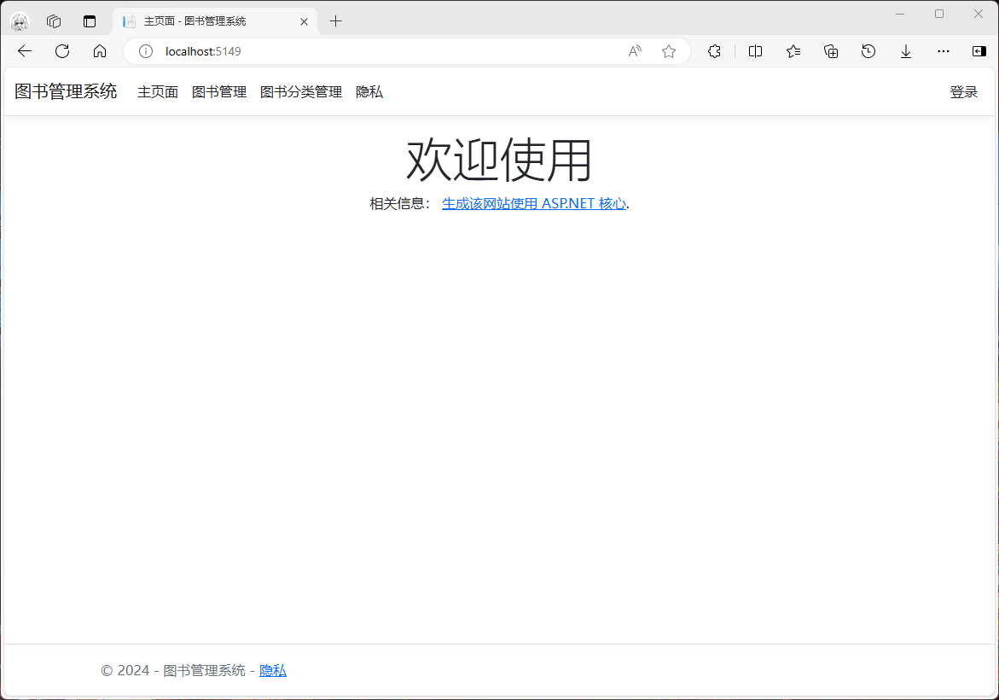

### 1.2 登录

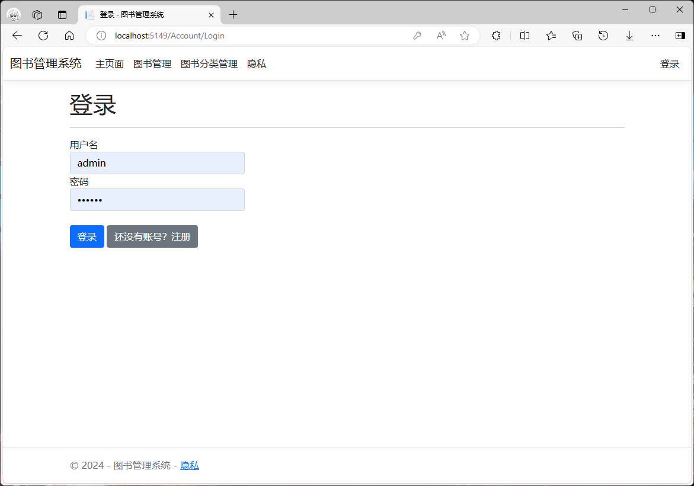

### 1.3 注册

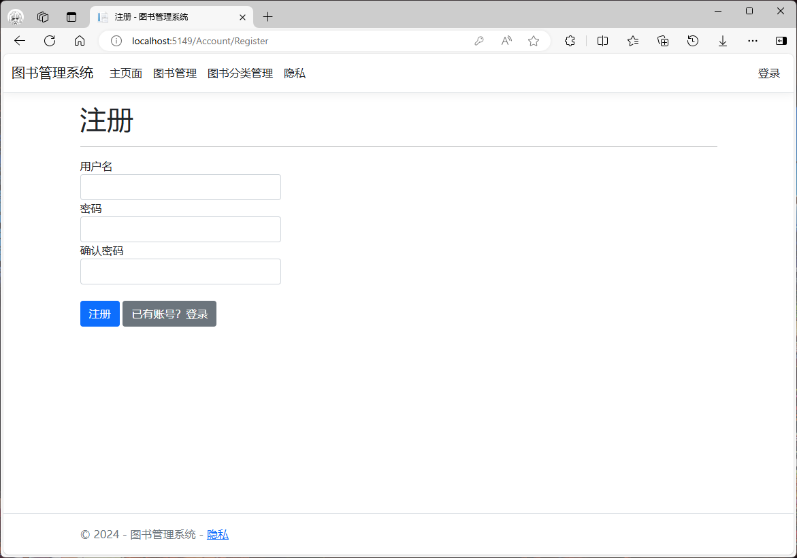

### 1.4 图书管理

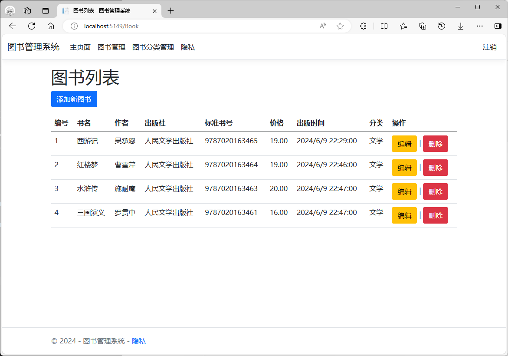

#### 1.4.1 添加图书

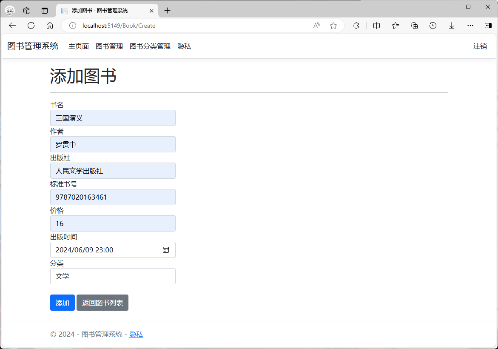

#### 1.4.2 编辑图书

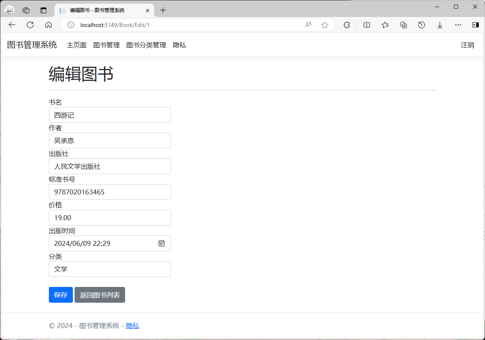

#### 1.4.3 删除图书

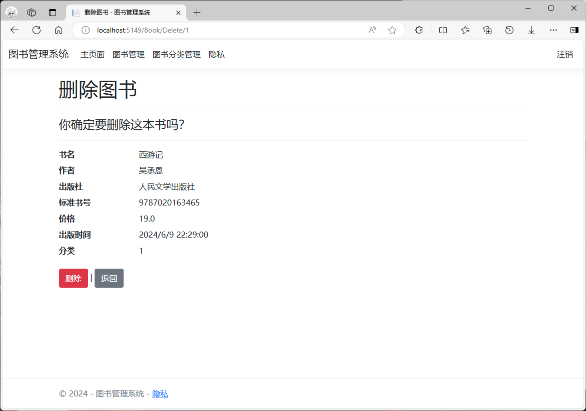

### 1.5 图书分类管理

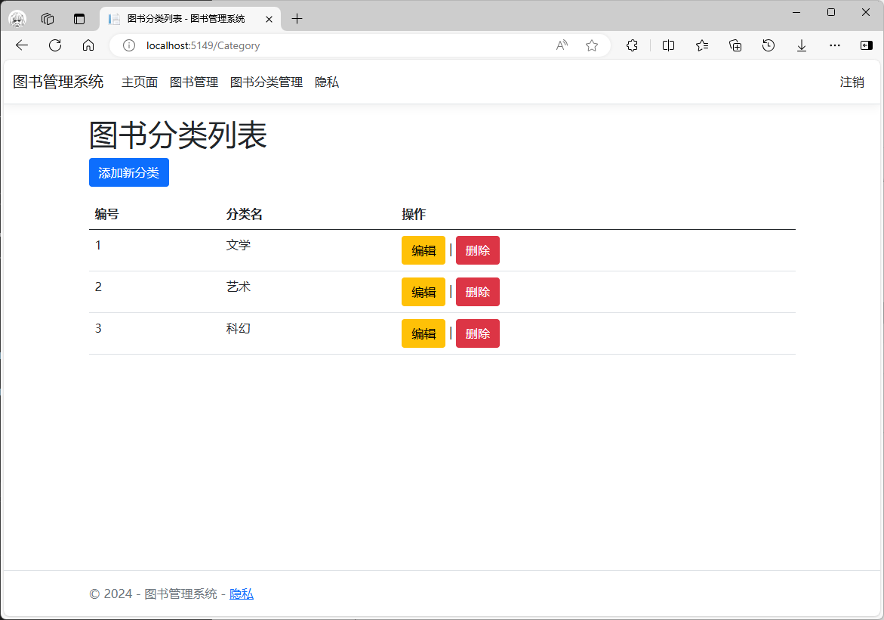

#### 1.5.1 添加图书分类

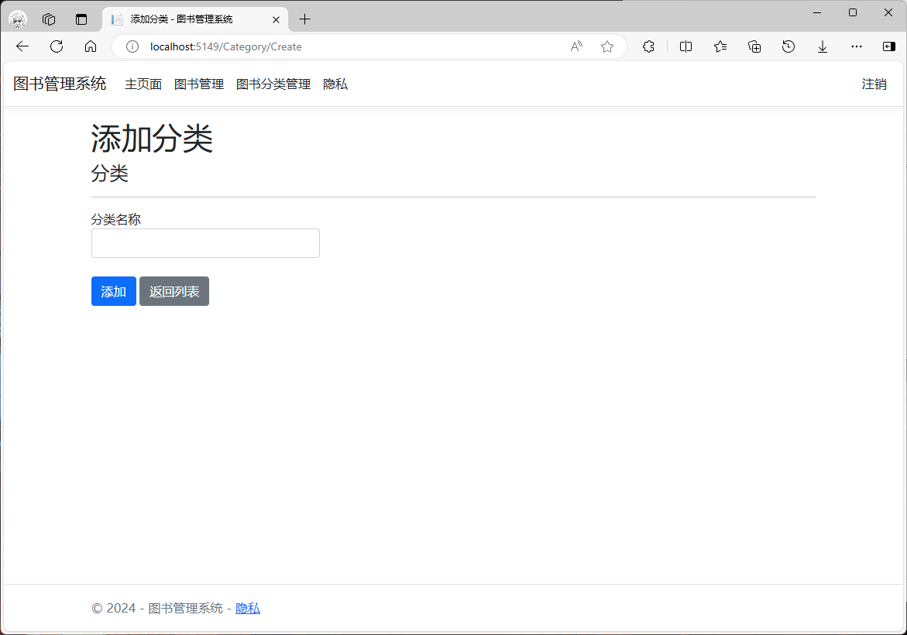

#### 1.5.2 编辑图书分类

#### 1.5.3 删除图书分类

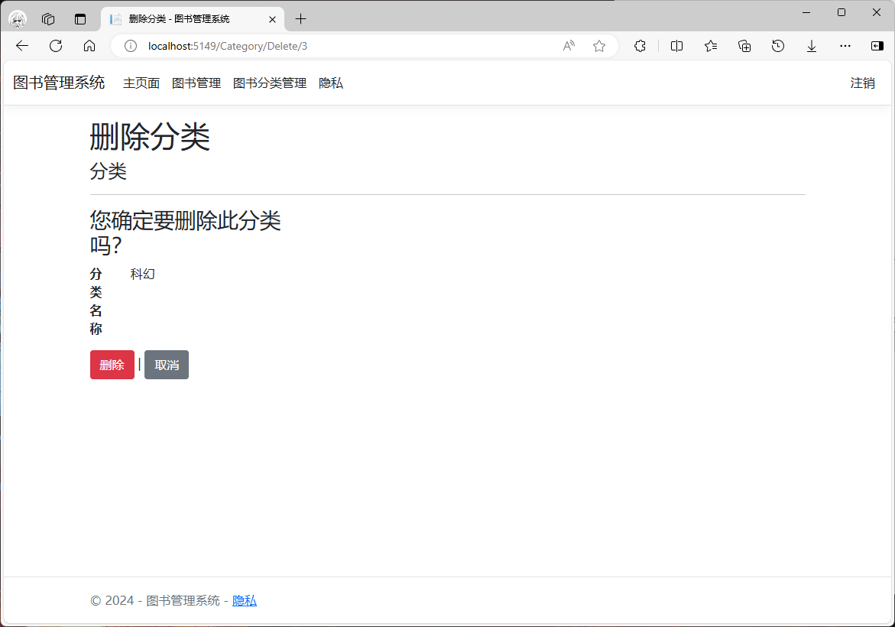

### 1.6 隐私

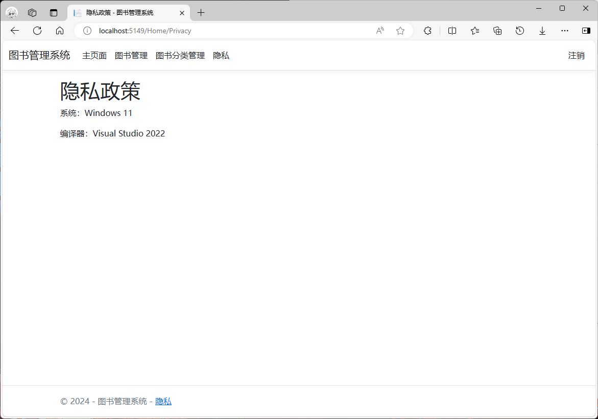