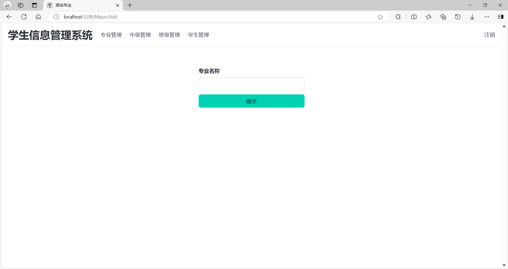
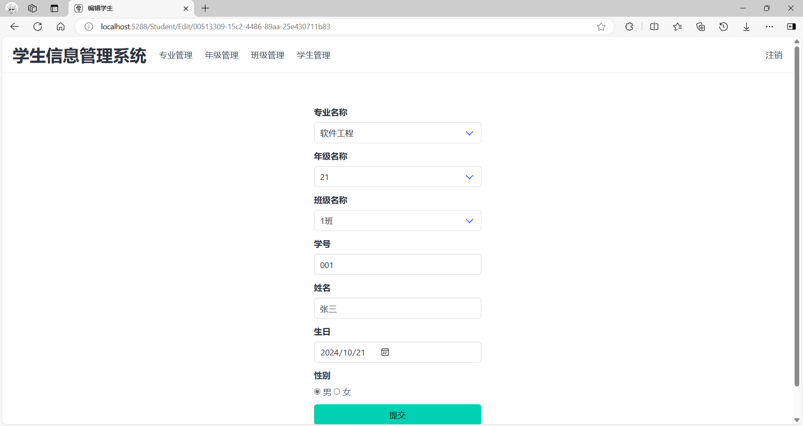

# 基于ASP.NET Core 的学生信息管理系统

## 1.环境配置

### 1.1开发工具包

1. dotnet-ef可以在后续开发中为数据库迁移和创建数据库做准备。

```
dotnet tool install --global dotnet-ef
dotnet-ef
```

2. Microsoft.EntityFrameworkCore.Sqlite是一个包含Sqlite数据库的EF Core框架包。

```
dotnet add package Microsoft.EntityFrameworkCore.Sqlite
```

3. Microsoft.AspNetCore.Identity.EntityFrameworkCore将 ASP.NET Core Identity 与 Entity Framework Core 集成，提供用于管理用户、角色和其他身份验证相关数据的默认实现。

```cmd
dotnet add package Microsoft.AspNetCore.Identity.EntityFrameworkCore
```

4. Microsoft.EntityFrameworkCore.Design用于生成迁移文件将模型类映射到数据库表。

```
dotnet add package Microsoft.EntityFrameworkCore.Design
```

> 需要注意的是，3个包的版本及dotnet-ef的版本需要保持一致，否则可能会出现错误。

### 1.2前端开发包

- **bulma**：CSS框架
- **sweetalert2**：弹窗库
- **htmx.js**：一个轻量级的 JavaScript 库，通过在 HTML 中使用属性来实现 AJAX 请求等功能

## 2.页面展示

### 2.1登录页面


### 2.2管理员首页


### 2.3教师首页


### 2.4专业管理页面


### 2.5年级管理页面


### 2.6班级管理页面


### 2.7学生管理页面


### 2.8专业添加和编辑页面




### 2.9年级添加和编辑页面


### 2.10班级添加和编辑页面


### 2.11学生添加和编辑页面




### 2.12非法删除专业弹窗


### 2.13非法删除年级弹窗


### 2.14非法删除班级弹窗


### 2.15成功删除学生弹窗


